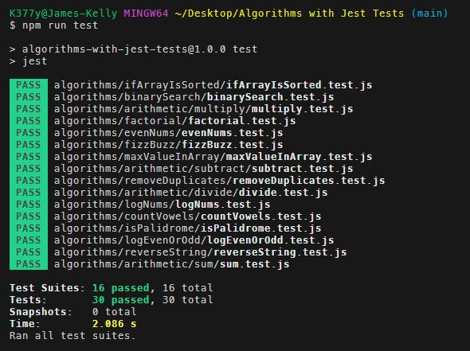
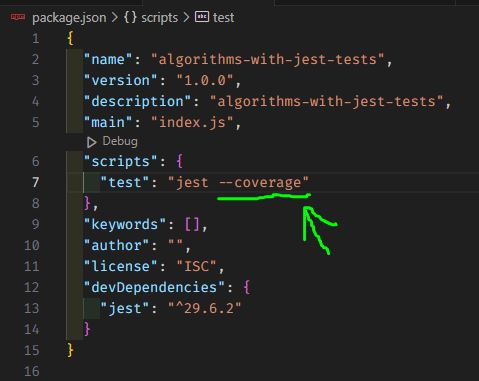
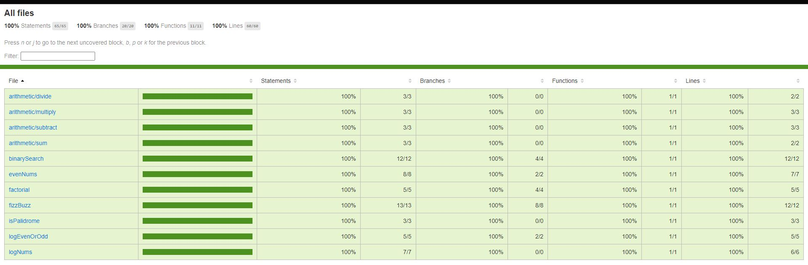

# Jest Testing with Algorithms

## Description
I am writing simple algorithms and practicing using the Jest NPM package to test them.

## Usage
You must have Node.js installed on your computer to run this program. 

Clone this repository to your local computer. 

To install Jest, run the following command from the root folder: 
In the terminal run `npm install` 

To run the tests, run the following command from the root folder: 
In the terminal run `npm run test` 

 
 

By adding `--coverage` to the jest script command, you can see more detailed results in the console and also additional files are generated with more detailed information. 

 

 

## *Questions*
<h3>Portfolio:&emsp;<a href="https://jk377y.dev" target="_blank">https://jk377y.dev</a></h3>
<h3>Email:&emsp;<a href="mailto:jk377y@gmail.com" target="_blank">jk377y@gmail.com</a></h3>
<h3>LinkedIn:&emsp;<a href="https://www.linkedin.com/in/james-kelly-software-developer/" target="_blank">https://www.linkedin.com/in/james-kelly-software-developer/</a></h3>
<h3>GitHub:&emsp;<a href="https://github.com/jk377y" target="_blank">https://github.com/jk377y</a></h3>
 

## *License*

 Copyright (c) 2023 James Kelly
 Information on this license can be found at: (https://opensource.org/licenses/MIT)
